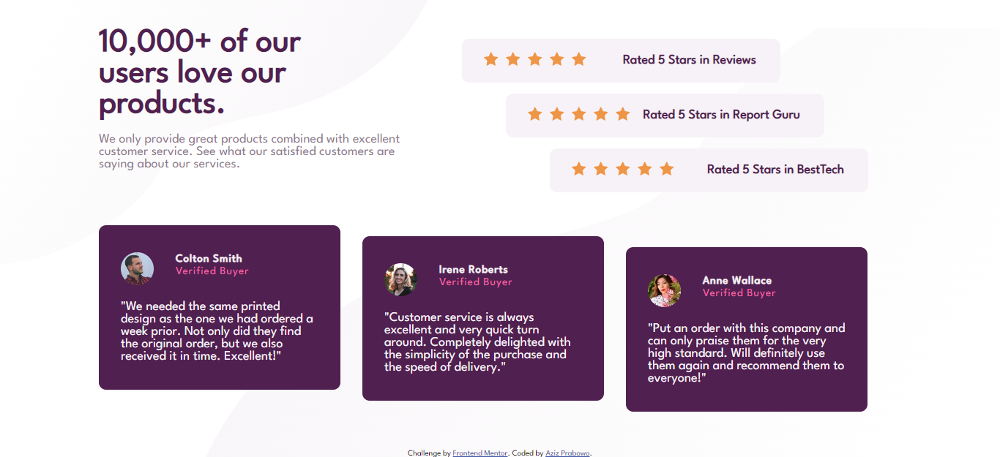

# Frontend Mentor - Social proof section solution

This is a solution to the [Social proof section challenge on Frontend Mentor](https://www.frontendmentor.io/challenges/social-proof-section-6e0qTv_bA). Frontend Mentor challenges help you improve your coding skills by building realistic projects.

## Table of contents

- [Overview](#overview)
  - [The challenge](#the-challenge)
  - [Screenshot](#screenshot)
  - [Links](#links)
- [My process](#my-process)
  - [Built with](#built-with)
  - [What I learned](#what-i-learned)
  - [Useful resources](#useful-resources)
- [Author](#author)

## Overview

### The challenge

Users should be able to:

- View the optimal layout for the section depending on their device's screen size


### Screenshot



### Links

- Solution URL: [SOLUTION](https://your-solution-url.com)
- Live Site URL: [LIVE SITE](https://your-live-site-url.com)

## My process

### Built with

- Semantic HTML5 markup
- CSS custom properties
- Flexbox
- CSS Grid
- Mobile-first workflow

### What I learned

I learned about CSS Grid and how to give background images to the top-left & bottom-right of the page.

To see how you can add code snippets, see below:

```css
html {
  background: url("images/bg-pattern-top-mobile.svg") left top no-repeat;
}

body {
  margin: 0;
  font-family: "League Spartan", Courier, monospace;
  background: url("images/bg-pattern-bottom-mobile.svg") right bottom no-repeat;
}

.review .user-1,
.review .user-2,
.review .user-3 {
  padding: 2.5em 2em;
  margin-bottom: 1em;
  border-radius: 10px;
  background-color: var(--clr-primary-review-bg);
  display: grid;
  grid-template-areas:
    "photo username ..."
    "photo status ..."
    "caption caption caption";
}
```

### Useful resources

- [Example resource 1](https://stackoverflow.com/questions/14373416/html-css-align-a-second-background-image-to-the-bottom-right-of-page) - This helped me for solving the background pattern issue.

## Author

- Frontend Mentor - [@azizp128](https://www.frontendmentor.io/profile/azizp128)
- Twitter - [@azizprbw](https://www.twitter.com/azizprbw)
